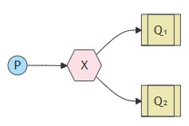
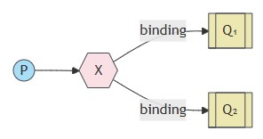
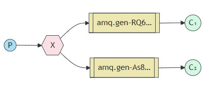

# .NET 8 RabbitMQ - Publish & Subscribe

In this exemple we'll deliver a message to multiple consumers. This pattern is known as "publish/subscribe".

To illustrate the pattern, we're going to build a simple logging system. It will consist of two programs -- the first will emit log messages and the second will receive and print them.

In our logging system every running copy of the receiver program will get the messages. That way we'll be able to run one receiver and direct the logs to disk; and at the same time we'll be able to run another receiver and see the logs on the screen.

Essentially, published log messages are going to be broadcast to all the receivers.

## Exchanges
Now it's time to introduce the full messaging model in Rabbit.

Let's quickly go over what we covered in Queue pattern:

- A producer is a user application that sends messages.
- A queue is a buffer that stores messages.
- A consumer is a user application that receives messages.

The core idea in the messaging model in RabbitMQ is that the producer never sends any messages directly to a queue. Actually, quite often the producer doesn't even know if a message will be delivered to any queue at all.

Instead, the producer can only send messages to an exchange. An exchange is a very simple thing. On one side it receives messages from producers and the other side it pushes them to queues. The exchange must know exactly what to do with a message it receives. Should it be appended to a particular queue? Should it be appended to many queues? Or should it get discarded. The rules for that are defined by the exchange type.



There are a few exchange types available: **__direct__**, **__topic__**, **__headers__** and **__fanout__**. We'll focus on the last one -- the fanout. Let's create an exchange of this type, and call it logs:


```CSharp
await channel.ExchangeDeclareAsync(exchange: "logs", type: ExchangeType.Fanout);
```

The fanout exchange is very simple. As you can probably guess from the name, it just broadcasts all the messages it receives to all the queues it knows. And that's exactly what we need for our logger.

> ### Listing exchanges
> To list the exchanges on the server you can run the ever useful rabbitmqctl:
> 
> ```linux
> sudo rabbitmqctl list_exchanges
> ```
>In this list there will be some amq.* exchanges and the default (unnamed) exchange. These are created by default, but it is unlikely ?you'll need to use them at the moment.

> ### The dafult exchange
>In previous parts of the tutorial we knew nothing about exchanges, but still were able to send messages to queues. That was possible because we were using a default exchange, which we identify by the empty string ("").
>
>Recall how we published a message before:
>
>dotnet/Send/Send.cs
> ```CSharp
>var body = Encoding.UTF8.GetBytes(message);
>
>await channel.BasicPublishAsync(exchange: string.Empty, routingKey: "hello", body: body);
>```
>
>The first parameter is the name of the exchange. The empty string denotes the default or nameless exchange: messages are routed to the queue with the name specified by routingKey, if it exists.

Now, we can publish to our named exchange instead:

**__dotnet/EmitLog/EmitLog.cs__**
```CSharp
var message = GetMessage(args);
var body = Encoding.UTF8.GetBytes(message);
await channel.BasicPublishAsync(exchange: "logs", routingKey: string.Empty, body: body);
```

# Temporary queues

As you may remember previously we were using queues that had specific names (remember hello and task_queue?). Being able to name a queue was crucial for us -- we needed to point the workers to the same queue. Giving a queue a name is important when you want to share the queue between producers and consumers.

But that's not the case for our logger. We want to hear about all log messages, not just a subset of them. We're also interested only in currently flowing messages not in the old ones. To solve that we need two things.

Firstly, whenever we connect to Rabbit we need a fresh, empty queue. To do this we could create a queue with a random name, or, even better - let the server choose a random queue name for us.

Secondly, once we disconnect the consumer the queue should be automatically deleted.

In the .NET client, when we supply no parameters to QueueDeclareAsync() we create a non-durable, exclusive, autodelete queue with a generated name:

**__dotnet/ReceiveLogs/ReceiveLogs.cs__**
```CSharp
QueueDeclareOk queueDeclareResult = await channel.QueueDeclareAsync();
string queueName = queueDeclareResult.QueueName;
```

You can learn more about the exclusive flag and other queue properties in the guide on queues.

At that point queueName contains a random queue name. For example it may look like **amq.gen-JzTY20BRgKO-HjmUJj0wLg**.

# Bindings



We've already created a fanout exchange and a queue. Now we need to tell the exchange to send messages to our queue. That relationship between exchange and a queue is called a binding.

**__dotnet/ReceiveLogs/ReceiveLogs.cs__**
```CSharp
await channel.QueueBindAsync(queue: queueName, exchange: "logs", routingKey: string.Empty);
```

From now on the **logs** exchange will append messages to our queue.

>## Listing bindings
>You can list existing bindings using, you guessed it,
>
>```linux
>rabbitmqctl list_bindings
>```
# Putting it al together

The producer program, which emits log messages, doesn't look much different from the previous tutorial. The most important change is that we now want to publish messages to our **logs** exchange instead of the nameless one. We need to supply a routingKey when sending, but its value is ignored for **fanout** exchanges. Here goes the code for **EmitLog.cs** file:

**__dotnet/EmitLog/EmitLog.cs__**
```CShap
using RabbitMQ.Client;
using System.Text;

var factory = new ConnectionFactory { HostName = "localhost" };
using var connection = await factory.CreateConnectionAsync();
using var channel = await connection.CreateChannelAsync();

await channel.ExchangeDeclareAsync(exchange: "logs", type: ExchangeType.Fanout);

var message = GetMessage(args);
var body = Encoding.UTF8.GetBytes(message);
await channel.BasicPublishAsync(exchange: "logs", routingKey: string.Empty, body: body);
Console.WriteLine($" [x] Sent {message}");

Console.WriteLine(" Press [enter] to exit.");
Console.ReadLine();

static string GetMessage(string[] args)
{
    return ((args.Length > 0) ? string.Join(" ", args) : "info: Hello World!");
}
```